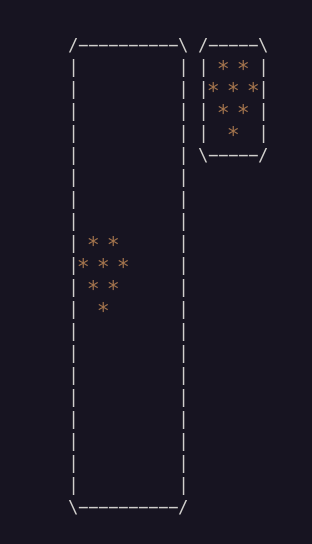

# Tetris project :desktop_computer:

## Done by Melissa and Maxime - Epitech 2022 :mortar_board:

### Overview

This project is a part of the **first** year of Epitech. <br>
We had **2 weeks** to complete it. :spiral_calendar: <br>

The goal of this project was to recreate a **Tetris game** in **C** using the **Ncurses library**. :video_game:<br>

### Features
```txt
    --help Display a help message
    -L --level={num} Start Tetris at level num (def: 1)
    -l --key-left={K} Move the tetrimino LEFT using the K key (def: left arrow)
    -r --key-right={K} Move the tetrimino RIGHT using the K key (def: right arrow)
    -t --key-turn={K} TURN the tetrimino clockwise 90d using the K key (def: top arrow)
    -d --key-drop={K} DROP the tetrimino using the K key (def: down arrow)
    -q --key-quit={K} QUIT the game using the K key (def: ‘q’ key)
    -p --key-pause={K} PAUSE/RESTART the game using the K key (def: space bar)
    --map-size={row,col} Set the numbers of rows and columns of the map (def: 20,10)
    -w --without-next Hide next tetrimino (def: false)
    -D --debug Debug mode (def: false)
```

### Running the project locally

From the repo:

- Clone this repostitory locally
- Run `make` in your bash / command line
- Run `./tetris <left-key-arrow> <right-key-arrow> <grop-key-arrow> <turn-key-arrow> <map-size>`
<br>

> **Warning**
> Make sure the Ncurses library is installed or the program won't work.

<br>

To try this program, you can use this **command** that will put the direction arrows to play and a map size of 20 by 20: <br>

```bash
make && ./tetris --key-left 68 --key-right 67 --key-drop 66 --key-turn 65 -map-size=20,20 && make fclean
```

An output you can get from this program can be:



Here are the different **tools** and **languages** we used to make this project: :hammer_and_wrench:

[](https://github.com/tandpfun/skill-icons)

Here is the **GitHub** of the person who did the project with me :
[Maxime Senard](https://github.com/RedCommand)
